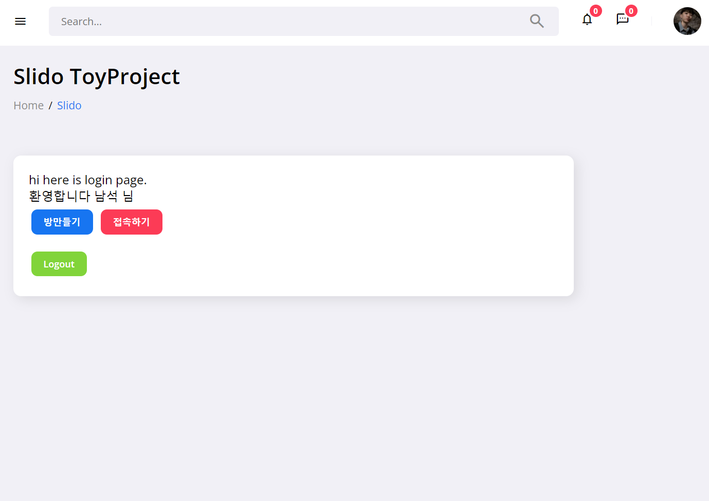
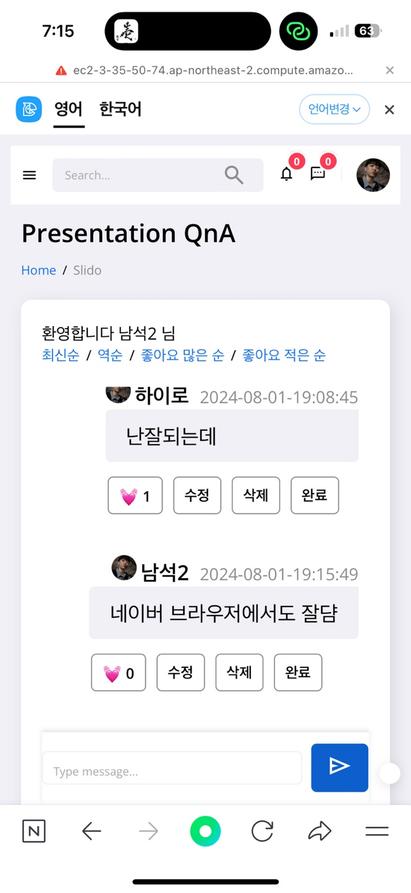

# Slido-project using Redis

Audience Interaction Made Easy - Slido-inspired toy project

Implemented simply using Redis.

This project is a **container-based application**, and user login is fetched from the web service API.

**Therefore, it requires a backend that can be executed together.**

## Start to Do
In docker-compose.yaml, set the following:

- `LOGIN_URL_ENDPOINT` : URL of the web service for login
- `USER_ACCOUNT_ID` : Login account ID
- `USER_ACCOUNT_PASWORD` : Login password  
   

- `REDIS_EXPIREDTIME_ROOM` : Room life cycle (minutes, default=60)

- `REDIS_EXPIREDTIME_COMMENT` : The room will be deleted if this time elapses since the last comment (minutes, default=20)

- `BATCH_FIXEDRATE` : Interval for scheduling batch (milliseconds, default=3000)

  

## Service image (kakao login)

## Service image (mobile)

